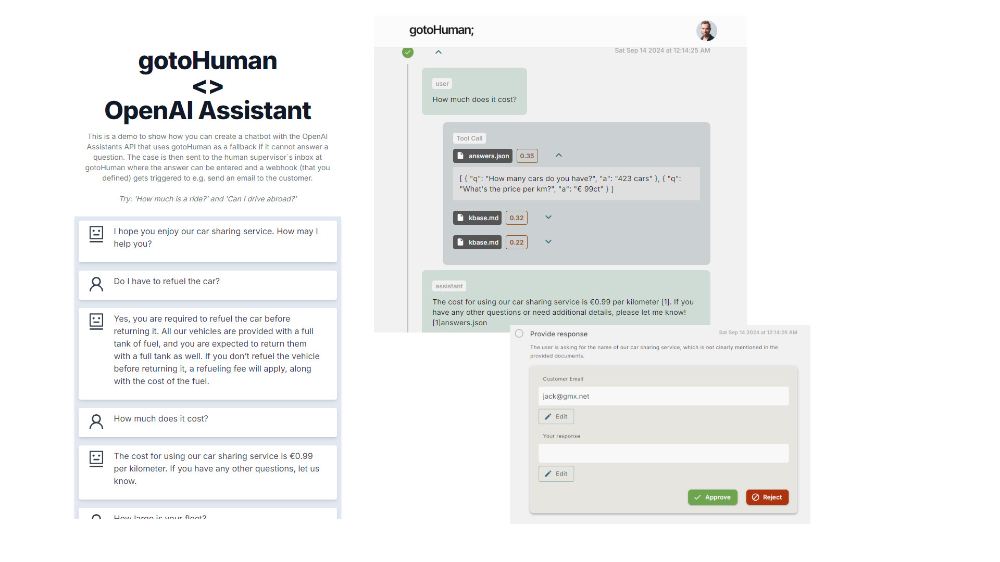

# OpenAI Assistants API <> gotoHuman

A NextJS demo chatbot
- using the OpenAI <b>Assistants API</b>
- using OpenAI's [<b>Structured Outputs</b>](https://platform.openai.com/docs/guides/structured-outputs/introduction) for reliable JSON schemas
- using [<b>gotoHuman</b>](https://gotohuman.com) to easily fallback to a human if the bot cannot answer a question

Any unanswered question gets sent to the human supervisor`s inbox at gotoHuman where the answer can be entered. This triggers a webhook (that you defined) so you can continue the workflow, e.g. to send an email to the customer.

### 1-click deploy

Deploy this app to Vercel in ~1 minute:

[](https://vercel.com/new/clone?repository-url=https%3A%2F%2Fgithub.com%2Fgotohuman%2Fgth-demo-openai-assistant-chatbot&env=OPENAI_API_KEY,GOTOHUMAN_API_KEY&project-name=gotohuman-demo-openai-assistant-chatbot&repository-name=gotohuman-demo-openai-assistant-chatbot&redirect-url=https%3A%2F%2Fapp.gotohuman.com%2Fadd-agent-from-template%2Fgth-demo-openai-assistant-chatbot)

### Run locally

Add your OpenAI API Key and your [gotoHuman API key](https://app.gotohuman.com) to `.env.local` or your Environment Variables:
```
OPENAI_API_KEY = sk-API_KEY_HERE
GOTOHUMAN_API_KEY = enterapikeyforgth
```

Run the app:
```
npm i
npm run dev
```

Open [http://localhost:3000](http://localhost:3000) to use the chatbot and [open gotoHuman](https://app.gotohuman.com) to see open cases that need human intervention.

### Webhook with human response
Our example is set up to handle the webhook that is triggered after the human responds also right here in our NextJS app (although you could handle it anywhere you like). If you want to try this out, and you don't use the Vercel 1-click deploy, you need to deploy the app yourself (or use ngrok) so gotoHuman can reach the webhook endpoint.  
Then in the gotoHuman settings, replace the placeholder webhook endpoint for the 'Customer Support Chatbot'. This agent connector is created for you after once running this example.  
In our example the endpoint is `DEPLOYMENT_URL/api/human-callback` since this is [the api route we use here](/app/api/human-callback/route.ts).

### Demo
